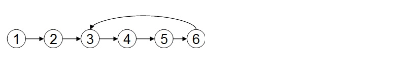

#第二章    链表

##前言
   
    就像之前说的，我们并不是来教大家数据结构的，我们是来整理小结数据结构的，所以只说重点。
    
##单链表及其操作

##前提条件
```

typedef struct Node{

      int num;
      
      struct Node * next;
      
}Node;


#define  SUCCESS   0        /*成功返回 0*/
#define  FAIL      -1       /*失败返回 -1*/

/* 带头节点单链表,代码亲测均可使用，且都为单线程，体现原理不考虑线程安全 */

```


###删除一个元素

```

int list_delete(Node *head,Node *pos);
@head  链表头结点
@pos   需要删除的结点

```

```

int list_delete(Node *head,Node * pos){
    
    if(!head || !pos){
        return FAIL;
    }

    Node *temp = head->next;    /*操作链表建议使用一个临时指针*/
    while(temp){                /*以防不经意之间修改了源链表*/
        if(temp->next->num == pos->num){
            temp->next = temp->next->next;
            return SUCCESS;
        }
        temp = temp->next;
    }

    return FAIL;

}

```


###添加一个元素

```
int list_add(Node *node ,Node *pos );
@node  :  在这个结点后添加新的结点
@pos   :  需要添加的新结点

```
```
int list_add(Node *node,Node *pos){
    
    if(!node || !pos){
        return FAIL;
    }

    pos->next = node->next;
    node->next = pos;
    
    return SUCCESS;
}

```


###本地逆置一个链表

```
Node *reserve_list(Node *head);
 
@head 原链表头结点

```

```
Node * reserve_list(Node *head){    /*这个逆置还是值看下的*/
    if(!head){
        return NULL;
    }
    Node *ptemp = head ;
    Node *prev  = NULL ;
    Node *pnext = NULL ;
    while(ptemp){
        pnext = ptemp->next;
        if(!pnext){
            head = ptemp;
        }

        ptemp->next = prev ;
        prev = ptemp  ;
        ptemp = pnext ;
    }

    return head;
}

```


###两个升序链表合并成一个链表（本地）

```
Node * mergeTwolist(Node *list1, Node *list2);

@list1  链表1 
@list2  链表2

```

```
Node * mergeTwolist(Node *list1, Node *list2){

    if(!list1 || !list2){
        return NULL;
    }

    Node * result ;
    result = (Node *)malloc(sizeof(struct Node));
    Node * temp = result ;
    while(list1 && list2){
        if(list1->num < list2->num){

            result->next = list1;
            list1 = list1->next ;

        }else{
            
            result->next = list2;
            list2 = list2->next ;
        }

        result = result->next ;
    }

    if(list1)
        result->next = list1 ;
    if(list2)
        result->next = list2 ;

    return  temp;
}


```


##循环双向链表及其操作

```

typedef struct Node{
 
   int num;
    
   struct Node *next;
   struct Node *prev;
   
}Node;


```

###删除一个元素

```
int list_del(Node *node){

    if(!node){
        return -1;
    }

    node->prev->next = node->next;
    node->next->prev = node->prev;

}

```


###添加一个元素


```
/*这里有一个条件编译，如果定义了AddTail 就往结点前面插入一个结点*/
int list_add(Node *node,Node * newnode){
    if(!node || !newnode){
        return -1;
    }
#ifdef AddTail
    newnode->prev = node->prev   ;
    newnode->next = node         ;
    newnode->prev->next = newnode;
    newnode->next->prev = newnode;
#else
    newnode->next = node->next   ;
    newnode->prev = node         ;
    newnode->next->prev = newnode;
    newnode->prev->next = newnode;
#endif

    return 0;

}

```


###判断一个单向链表是否有环

如何判断一个链表是否有环是一个经典的面试问题：



有两个方法：

方法一：使用p、q两个指针，p总是向前走，但q每次都从头开始走，对于每个节点，看p走的步数是否和q一样。如图，当p从6走到3时，用了6步，此时若q从head出发，则只需两步就到3，因而步数不等，出现矛盾，存在环

方法二：使用p、q两个指针，p每次向前走一步，q每次向前走两步，若在某个时候p == q，则存在环。
