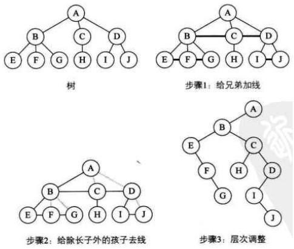
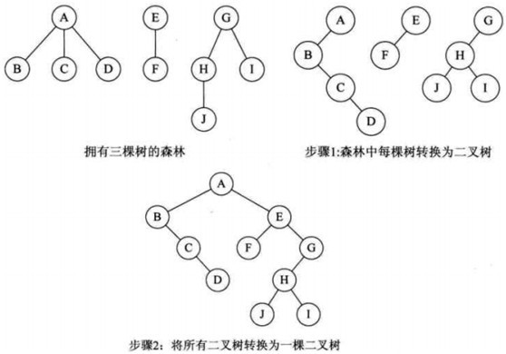
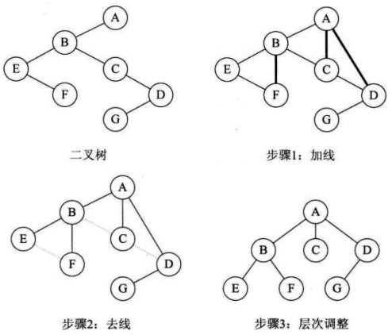
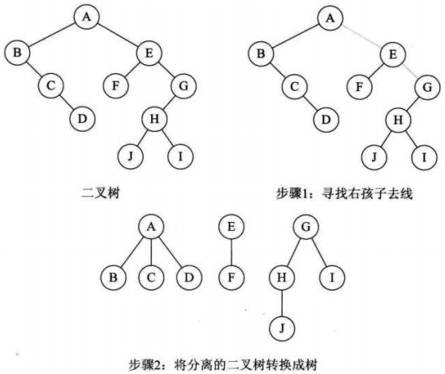

#第六章   树（2）

##前言
    
    上以小节主要小结了一些树的基本知识，以及二叉树的一些简单操作，这一节主要小结以下问题：
       ps: 本次的辅助栈与队列都是链栈与链队，代码不在正文中出现，都在附录中,代码亲测，皆可正确运行。
       
       1. 非递归遍历二叉树
       2. 树与森林
       
       
###非递归遍历二叉树

####先序遍历

    非递归先序遍历二叉树，比较容易理解。方法如下：
    1.首先将根结点入栈，然后依次入其左子树，直到左子树为NULL。
    2.如果栈非空，就弹出栈顶元素，然后进入右子树。
    
```
    void pre_tree(node *root){
    
    node *p;
    stack *S;
    S = INIT_stack();
    p = root;
    while(p || isEmpty(S)){
            
        while(p){
            printf(" %c ",p->data);
            push(S,p);
            p = p->lchild;
        }

        if(isEmpty(S)){
            p = pop(S);
            p = p->rchild;
        }

    }   
    printf("\n");
}

```
 

####中序遍历

    非递归中序遍历二叉树，直接说通用的简洁的。方法如下：
    从根结点开始，当前结点存在或栈不为空 ，重复如下两个步骤。
    1. 若当前结点存在，则当前结点进栈，并进入其左子树。
    2. 否则，退栈并访问出栈结点，然后进入其右子树。
    
```
    void med_tree(node * root){
    
    node *p;
    stack *S;
    S = INIT_stack();
    p = root ;
    while(p || isEmpty(S)){
        if(p != NULL){
            push(S,p);
            p = p->lchild;
        }else{
            p = pop(S);
            printf(" %c ",p->data);
            p = p->rchild;
        }
    }
    printf("\n");
}

```    

####后序遍历
    
    非递归后序遍历二叉树，比先序和中序能复杂一些。方法如下：
    1.当前结点开始进栈，并进入其左子树，重复直到当前结点为空。
    2.如果栈非空，判断栈顶p的右子树是否非空，右子树是否刚刚访问过，如果是就退栈，访问 
    p结点，p赋给q,p置空；不是，则进入p的右子树。
    
```
    void post_tree(node *root){
    node *p,*q;
    stack *S;
    S = INIT_stack();
    p = root ;
    while(p || isEmpty(S)){
        while(NULL != p){
            push(S,p);
            p = p->lchild;
        }
        if(isEmpty(S)){
            p = gettop(S);
            if(p->rchild == NULL || p->rchild == q){
                p = pop(S);
                printf(" %c ",p->data);
                q = p;
                p = NULL;
            }else{
                p = p->rchild;
            }
        }
    
    }

    printf("\n");
}

```
    
####按照层来遍历二叉树

方法：主要借助队列完成按照层次遍历二叉树

首先根结点入队，当队列非空

1.队头结点出队，并访问出队结点

2.出队结点的非空左，右孩子依次入队

```
void levelorder( node *root ){
    queue * Q;
    Q = INIT_queue();
    node *temp;
    temp = root ;
    queue_inq(Q,temp);
    while(isEmpty_q(Q)){
        temp = queue_deq(Q);
        printf("%c ",temp->data);
        if(temp->lchild != NULL)
            queue_inq(Q,temp->lchild);
        if(temp->rchild != NULL)
            queue_inq(Q,temp->rchild);
    }
    

}


```

###关于线索二叉树

其实二叉树也可以在逻辑上变成一个链表，我们只需要把所有的结点按照一定的规律排出来。当然在该序列中，每一个结点都有自己的唯一前驱就是它的父结点，并且有唯一后继结点，其实根据遍历的方式不同它的后继结点会有变化。

由以上的思考我们进一步思考如何表示一棵线索二叉树，以前使用的是二叉链表，只有左右孩子并没有可以表示父结点的东西，所以我们对结构体做出修改。

```
typedef struct node{

    char data  ;
    int ltag    ;
    int rtag ;
    struct node *lchild ;
    struct node *rchild ;
    
}

```

当ltag = 0 指针lchild 指示左孩子，否则指向前驱

当rtag = 0 指针rchild 指示右孩子，否则指向后继

一个中序线索化的示例

```
void  inthread(node * root){

    if(root != NULL){
        inthread(root->lchild);
        if(root->rchild == NULL){
            root->lchild = pre;
            root->ltag   = 1  ;
        }
        if(pre != NULL && pre->rchild == NULL){
            pre->rchild = root;
            pre->rtag    =  1  ;
        }
        pre = root ;
        inthread(root->rchild);
    }
}

```

####在线索二叉树中找结点

这里举个例子就好，其实在线索二叉树中寻找结点已经很类似在链表中查找元素了，逻辑上此时它就是一条链表。

```
node *find(node *p){
    node * pre;
    node * p  ;
    if(p->ltag == 1){
        pre = p->lchild;
    }else{
        for(q = p->lchild;q->rtag == 0;q = q->rchild)
            pre = q;
    }
    
    
    return pre;
        
```

###关于树与森林

    森里其实和图就很近了，关于森林与树，掌握转换方法就好，我附上转换的图。
    普通的树转换为二叉树：



森林转换二叉树



二叉树转换为树



二叉树转换为森林



图来自这个链接，就转换写得不错

http://www.cnblogs.com/zhuyf87/archive/2012/11/04/2753950.html


###小结
关于二叉树学校大概就讲了这么多，还记得我们的宗旨吗？总结考点，了解额外的知识。所以下来不着急进入图，我们来探秘查找树，AVL树，以及B树的奥秘。
