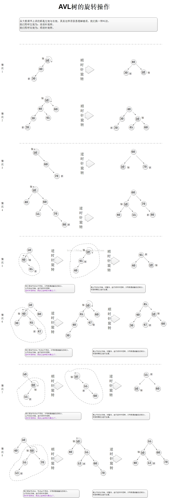

#第七章  AVL 平衡二叉树 伸展树

##AVL 

AVL树是最先发明的自平衡二叉查找树。在AVL树中任何节点的两个儿子子树的高度最大差别为一，所以它也被称为高度平衡树。查找、插入和删除在平均和最坏情况下都是O（log n）。增加和删除可能需要通过一次或多次树旋转来重新平衡这个树。

##图解

东西太多感觉不好说了，直接图解吧。

代码暂时等等。等我期末考完就补上。

##伸展树

伸展树（Splay Tree，事实上在国内OI界常常被称作Spaly Tree，与此同理的还有Treap），也叫分裂树，是一种二叉排序树，它能在O(log n)内完成插入、查找和删除操作。它由Daniel Sleator和Robert Tarjan创造，后者对其进行了改进。它的优势在于不需要记录用于平衡树的冗余信息。在伸展树上的一般操作都基于伸展操作。