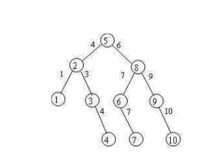

#第七章   查找 

##几种查找算法

1.顺序查找

2.折半查找

3.分块查找

4.基于树的查找

##平均查找长度

为确定某元素在查找表中的位置需要和给定值进行比较的关键字个数的期望值，称为该查找算法查找成功时的平均查找长度。

##基于线性表的查找

很简单，时间复杂度为O（N）。
这里只说那个改进的线性表查找好了。

```
int Seqsearch(SeqRlist L,KeyType K){
    L.r[0].key = K;
    i = L.length;
    while(L.r[i].key != K){
        i--;
    }
    returni;

}
```

##折半查找

这是另一种查找的方法，但是有2个要求：

1.这个序列必须是有序的

2.必须基于顺序查找

```
非递归实现
int binsrch(seqlist L,keytype K){

    int low = 1;
    int high = L.length;
    int mid;
    while(low <= high){
        mid = (low + high)/2;
        if(K == L.r[mid].key){
            return mid;
        }else if(K < L.r[mid].key){
            high = mid -1;
        }else{
            low = mid + 1;
        }
    }

    return 0;

}


递归实现

int bin_search(int key[],int low,int high,int k){
    int mid;
    if(low > high){
        return -1;
    }else{
    
        mid = (low + high)/2;
        if(key[mid] == k){
            return mid;
        }
        if(k > key[mid]){
            return  bin_search(key,mid+1,high,k);
        }else{
            return  bin_search(key,low,mid-1,k);
        }
   }

}

```
时间复杂度：
    ASL = log2(n+1)-1
    
关于这折半查找我还要说一点，就是折半查找树和成功与失败的计数。
根据有序的数列建立的一棵树。
以中间元素作为根结点。

然后它的左子树的数值都要比有子树的数值小，这是一个递归适用的定义。

容我搞个截图

1，2，3，4，5，6，7，8，9，10




可以建立这样一棵查找树，我们需要做的就是计算ASL的值，成功与失败两种情况。

例如我们需要查找 4 这个元素

ASL（成功） = (1*1 + 2*2 +3*4 + 4*3)/10

ASL(失败） = （ 5*3 + 6*4  ）/11  失败主要根据空叶子结点计算出结果

##索引查找

索引查找是在索引表和主表(即线性表的索引存储结构)上进行的查找。索引查找的过程是：首先根据给定的索引值K1，在索引表上查找出索引值等于K1的索引项，以确定K1对应的子表在主表中的开始位置和长度，然后再根据给定的关键字K2，在对应的子表中查找出关键字等于K2的元素(结点)。
对索引表或子表进行查找时，若表是顺序存储的有序表，则既可进行顺序查找，也可进行二分查找。否则只能进行顺序查找。


基本思想：

1.把线性表分成若干块，每一块包含若干个记录，在每一块中记录的存放是任意的，但是块与块之间必须是有序的。

2.建立一个索引表，把每块中的最大关键字值以及每一块的记录在表中的位置和最后一个记录在表中的位置存放在索引项中，所以索引表是一个有序表。


