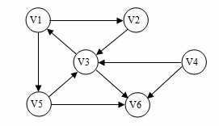
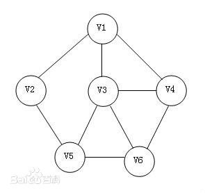
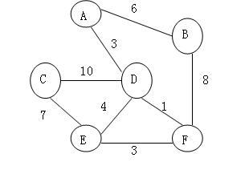
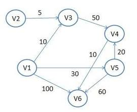
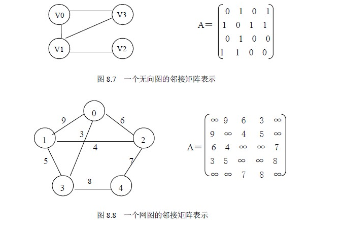
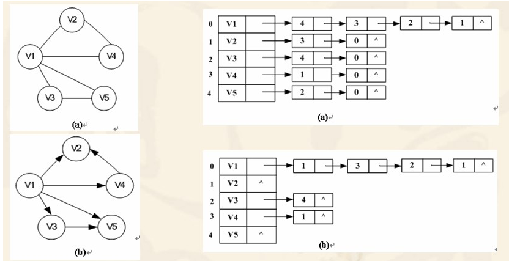
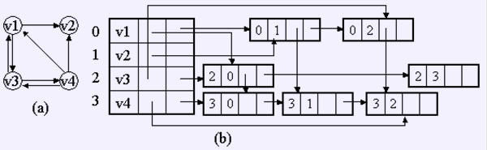
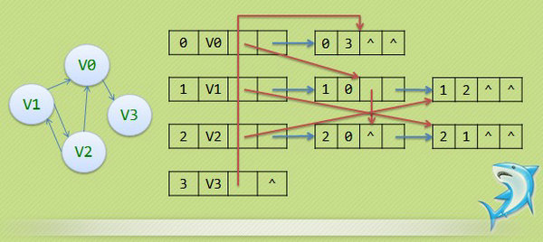

#第八章   图论及其算法(一）

##基础概念
ps:所有代码亲测可用
###图的定义
    
    图是由顶点集和弧集构成的数据结构，Graph = (V,R);
    
###有向图

    由顶点集和弧集构成的图称为有向图。（弧是有方向的）


    
###无向图

    由顶点集和边集构成的图称为无向图。（边是无方向的）

 
    
###有向网或无向网

    有向图或无向图中的弧或边带权后的图分别称为有向网或无向网。
    
无向网    


有向网


    
###子图

    子图简单来说就是图的一部分，类比子树的概念很好理解。
    
###完全图

    图有n个顶点，n(n-1)/2 条边的无向图称为完全图。
    
    
###有向完全图
    
     图有n个顶点，n(n-1)/2 条弧的无向图称为完全图。（这里是 弧 不是边了）
     
###稀疏图

    假设图中有n 个顶点e 条边（弧），如果边（弧）的个数 e<nlongn,则称之为稀疏图，否则称之
    为稠密图。
    
###邻接点

    无向图中有一条边的相连的两个顶点互称为邻接点，并且称边依附于这两个顶点。
    
###顶点的度

    在无向图中与某个顶点关联的边的数目定义为这个顶点的度。
    
###路径

    顶点与顶点中之间存在的一条连通的路径。
    
###简单路径

    顶点不重复的路径称为简单路径。
    
###回路

    首尾顶点相同的路径称为回路
    
###简单回路

    除了首尾顶点，中间任何一个顶点不重复的回路称为简单回路。
    
###连通图

    在无向图中两个结点i 和 j 如果着两个顶点中间有路径，则称i 和  j 是连通的，如果无向图中
    任意两个顶点之间都存在路径相通，则称之为连通图。无向图中各个极大连通子图称为该图的连通
    分量。
    
###强连通图

    在有向图中，若任意两个顶点之间都存在一条有向路径，则称此有向图为强连通图。有向图中各个
    极大强连通子图称为该图的强连通分量。
    
###生成树

    包含连通图中全部顶点的极小连通子图称为该图的生成树。
    
    
##图的存储

###邻接矩阵
    
    图的邻接矩阵是表示顶点之间相邻关系的矩阵，是顺序存储结构，也成为数组表示法。
    其实就是使用一个二维数组来存储一个图的信息。
    设图G是一个具有N个顶点的图，它的顶点集合V = {v0,v1,v2,v3,...,v(n-1)},则顶点之间的
    关系可用如下形式的矩阵A来描述，即矩阵A中的每个元素A[i][j]满足：
    
              1   则表示vi,vj 有连通关系
    A[i][j] 
              0   没有连通关系
              



```
#define  MAXVEX      20      /*最大顶点个数*/
#define  INFINITY    32767   /*表示极大值，个人感觉用-1更好*/

typedef int vextype ;        /*顶点类型*/

typedef struct AdjMatrix{     /*一个图的控制信息*/

    int arcs[MAXVEX][MAXVEX];      /*矩阵*/
    vextype vex[MAXVEX];           /*顶点数组*/
    int vexnum         ;           /*顶点个数*/
    int arcnum         ;           /*边的个数*/

}AdjMatrix ;


创建一个无向网，（带权）

void  AdjMatrix_create(AdjMatrix *G){
    
    int i,j,k,weight,vex1,vex2;
    printf("vexnum  and  arcnum：\n");

    scanf("%d,%d",&G->vexnum,&G->arcnum);


    for(i = 1; i <= G->vexnum;i++){            /*init the graph*/
        for(j = 1; j <= G->vexnum;j++){
            G->arcs[i][j] = INFINITY ;
        }
    }
    
    for(k = 0;k < G->arcnum;k++){
        printf("please enter vex1 and vex2\n");
        scanf("%d,%d",&vex1,&vex2);

        printf("please enter weight\n");
        scanf("%d",&weight);
        
        G->arcs[vex1][vex2] = weight;
        G->arcs[vex2][vex1] = weight;  /*如果是有向网删除这句就好，不需要对称*/
    }  


}


```

几点说明：
    
    对于无向图：第i个顶点的度就等于矩阵中第i行非零元素。
    对于有向图：第i个顶点的出度就等于矩阵中第i行非零元素个数。
              第i个顶点的入读就等于矩阵中第i列非零元素个数。

###邻接表

    当图中的边数远远小于图中的顶点数时，就是稀疏图的时候，邻接矩阵就成为稀疏矩阵，如果继续
    使用邻接矩阵就会造成很大的浪费，一个较好的解决方案就是采用邻接表。这里所有的顶点之间是
    平行关系，不存在顺序关系。
      


下来说下变量类型和创建代码。
```
typedef struct ArcNode{         /* node type  结点类型 */
    
    int adjvex ;
    int weight ;
    struct ArcNode *next;

}ArcNode;


typedef struct VertexNode{    /* 数组实例*/
    
    char vexdata ;
    ArcNode *head;

}VertexNode;


typedef struct AdjList{
    
    VertexNode vertex[MAXVEX];
    int vexnum;
    int arcnum;


}AdjList;          /*邻接表结构体*/


创建一个邻接表，这里只有函数代码，完整可测试代码在附录

void AdjList_create(AdjList *G){
    
    int i,j,k;
    int vex1,vex2,weight;
    if(!G){
        printf("G need cast a spece\n");
        return ;
    }
    
    printf("please enter the vexnum and arcnum\n");

    scanf("%d,%d",&G->vexnum,&G->arcnum);

    for(i = 1;i <= G->vexnum;i++){

        G->vertex[i].head  = NULL;

    }


    for(i = 1;i <= G->arcnum;i++){
        printf("please enter the vex1 and vex2 and weight\n");
        scanf("%d,%d,%d",&vex1,&vex2,&weight);
        add_node(G,vex1,vex2,weight);
        
    }

}

void add_node(AdjList *G,int vex1,int vex2,int weight){

    ArcNode *p,*q;
    p = (ArcNode *)malloc(sizeof(struct ArcNode));
    p->adjvex = vex2  ;
    p->weight = weight;
    q = G->vertex[vex1].head;
    do{
        if(NULL == q){
            G->vertex[vex1].head  = p;
            break;
        }else if(NULL == q->next){
            q->next = p;
            p->next = NULL;
            break;
        }else{
            q = q->next;
        }
    }while(1);
    
    return ;

}

```

###十字链表

这并非考试常考考点，简要说明。

十字链表是有向图的另一种存储结构，可以看成是邻接表与逆邻接表的结合。仍然由边表和顶点组成。




```
#define   MAXVEX   20

typedef struct  ArcNode{

    int tailvex,headvex;
    int weight         ;
    struct ArcNode *hnextarc,*tnextarc;
    
}ArcNode;

typedef struct VertexNode{

    char vexdata;
    ArcNode *head,*tail;
    
}Vertexxnode;

typedef struct  OrthList{

    VertexNode vertex[MAXVEX];
    int vexnum;
    int arcnum;
  
}OrthList;

 
 
一些说明：

tailvex   headvex  hnextarc  tnextarc  info
边表结点结构

vexdata   head  tail
顶点表结点结构

headvex : 弧头
tailvex : 弧尾
hnextarc: 指向具有同一弧头顶点的下一条弧
tnextarc: 指向具有同一弧尾顶点的下一条弧
info :表示弧权值等信息

vexdata:  顶点的相关数据结构信息
head   :  以该顶点为弧头的边表指针
tail   :  以该顶点为弧尾的边表头指针

```

###多重链表

多重链表是适用于无向图的链式存储结构。它是邻接表的改进，主要解决了在邻接表中对边表操作不方便的问题。



这个插图确实没找好。。。。

```
#define  MAXVEX   20

typedef struct ArcNode{

    int mark,ivex,jvex;
    int weight;
    struct ArcNode *inext,*jnext;
    
}ArcNode;

typedef struct VertexNode{

    char vexdata;
    ArcNode *head;
    
}VertexNode;

typedef struct AdjMultipleList{

    VertexNode vertex[MAXVEX];
    int  vexnum;
    int  arcnum;
    
}AdjMultipleList;


    
```

