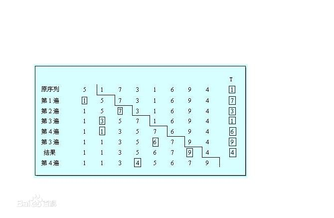

#第9章排序   插入排序


##插入排序

      时间复杂度：最坏的情况下为O(n^2)。
      
      适用场景： 对于小规模的输入来说，插入排序法是一个快速的排序算法，所以在规模很小的情况下
      ， 使用这种算法还是很有优势的。
      
      空间复杂度：它只需要一个元素的辅助空间，就是监视哨，用于元素交换所以空间复杂度为O（1）。
      
      稳定性：  插入排序是稳定的。
      
      适用性：  可以适用数组与链表两种存储方式
      
##图解




##简单实现
```
#define MAXSIZE 1000

typedef struct list{

    int r[MAXSIZE+1];
    int length;

}list_array;


void InsertSort(list_array L){
    int i,j;
    for(i = 2;i <= L.length;i++){
        if(L.r[i]< L.r[i-1]){
            L.r[0] = L.r[i];
            for(j = i-1;L.r[0]<L.r[j];j--)
                L.r[j+1] = L.r[j];
            L.r[j+1] = L.r[0];
        }
    }
}

```

      