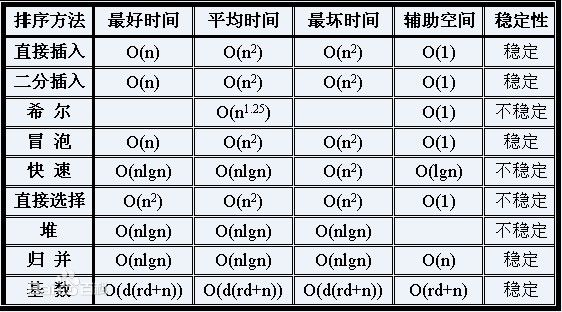

#第九章  查找  选择排序

##选择排序


选择排序（Selection sort）是一种简单直观的排序算法。它的工作原理是每一次从待排序的数据元素中选出最小（或最大）的一个元素，存放在序列的起始位置，直到全部待排序的数据元素排完。 


##时间复杂度,及稳定度分析

选择排序的交换操作介于 0 和 (n - 1） 次之间。选择排序的比较操作为 n (n - 1） / 2 次之间。选择排序的赋值操作介于 0 和 3 (n - 1） 次之间。



选择排序是一个不稳定的排序算法。

 
```

void SelectSort(RecordList L){

    int i,j,k;
    for(i = 1;i <= L.length-1;i++){
        k = i;
        for(j = i+1;j <= L.lenghth-1;j++){
            if(L.r[i] < L.r[k])
                k = j;
            if(k != i){
                t = L.r[i];
                L.r[i] = L.r[k];
                L.r[k] = t;
            }
        }
    }


}
```