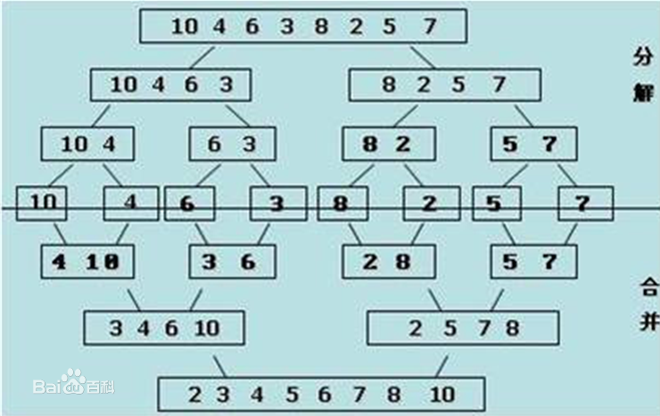

#第九章  排序  归并排序

##归并排序

时间复杂度：
      O(nlog2N)
      
空间复杂度：
      只需要一个空间O（N）
   
稳定性：稳定排序




```
void merge(int *add,int len)
{
    int lenA  = 0   , lenB = 0,lenC = 0,lentmp = 0;
    int *arrC = NULL;
    
    if(len <= 1){
        return;
    }
    arrC = (int *)malloc(len*sizeof(int));
    lentmp = len/2;
    
    merge(add,lentmp);
    merge(&add[lentmp],len-lentmp);
   
    lenA   = 0, lenB = lentmp;
    lenC   = 0;
    
    while((lenA != lentmp) && (lenB != len)){
         if(add[lenA] < add[lenB]){
              arrC[lenC] = add[lenA];
              lenA++;
         }else{
              arrC[lenC] = add[lenB];
              lenB++;
         }
         lenC++;
    }
    
    if(lenA == lentmp){
         while(lenB < len){
             arrC[lenC++] = add[lenB++];
         }
    }else if(lenB == len){
         while(lenA < lentmp){
             arrC[lenC++] = add[lenA++];
         }
    }else{
         //printf("all ok!\n");
    }

    memcpy(add,arrC,len*sizeof(int));
    
    free(arrC);
}
```