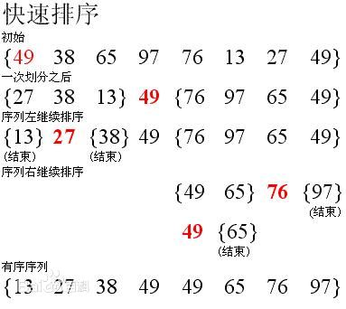

#第九章  排序  快速排序

##快速排序

快速排序（Quicksort）是对冒泡排序的一种改进。
快速排序由C. A. R. Hoare在1962年提出。它的基本思想是：通过一趟排序将要排序的数据分割成独立的两部分，其中一部分的所有数据都比另外一部分的所有数据都要小，然后再按此方法对这两部分数据分别进行快速排序，整个排序过程可以递归进行，以此达到整个数据变成有序序列。


设要排序的数组是A[0]……A[N-1]，首先任意选取一个数据（通常选用数组的第一个数）作为关键数据，然后将所有比它小的数都放到它前面，所有比它大的数都放到它后面，这个过程称为一趟快速排序。值得注意的是，快速排序不是一种稳定的排序算法，也就是说，多个相同的值的相对位置也许会在算法结束时产生变动。


一趟快速排序的算法是：

（1）设置两个变量i、j，排序开始的时候：i=0，j=N-1；

（2）以第一个数组元素作为关键数据，赋值给key，即key=A[0]；

（3）从j开始向前搜索，即由后开始向前搜索(j--)，找到第一个小于key的值A[j]，将A[j]和A[i]互换；

（4）从i开始向后搜索，即由前开始向后搜索(i++)，找到第一个大于key的A[i]，将A[i]和A[j]互换；

（5）重复第3、4步，直到i=j； (3,4步中，没找到符合条件的值，即3中A[j]不小于key,4中A[i]不大于key的时候改变j、i的值，使得j=j-1，i=i+1，直至找到为止。找到符合条件的值，进行交换的时候i， j指针位置不变。另外，i==j这一过程一定正好是i+或j-完成的时候，此时令循环结束）。




###代码实现

```
int __quicksort(RecordList L,int low,int high){

    L.r[0] = L.r[low];
    while(low < high){

        while(low < high && L.r[high] >= L.r[0])
            --high;
        L.r[low] = L.r[high];
        while(low < high && L.r[low] < L.r[0])
            ++low;
        L.r[high] = L.r[low];

    }
    L.r[low] = L.r[0];

    return low;

}


void quicksort(RecordList L,int low,int high){
    
    if(low < high){
        pos = quicksort(L,low,high);
        __quicksort(L,low,pos-1);
        __quicksort(L,pos+1,high);

    }

}

```


