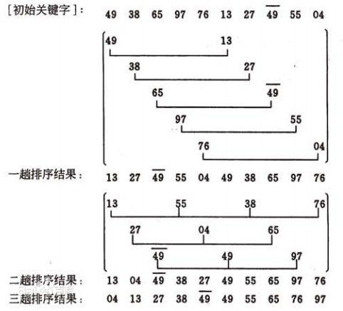

#第九章  排序  希尔排序


##希尔排序

希尔排序(Shell Sort)是插入排序的一种。也称缩小增量排序，是直接插入排序算法的一种更高效的改进版本。希尔排序是非稳定排序算法。该方法因DL．Shell于1959年提出而得名。
希尔排序是把记录按下标的一定增量分组，对每组使用直接插入排序算法排序；随着增量逐渐减少，每组包含的关键词越来越多，当增量减至1时，整个文件恰被分成一组，算法便终止

先取一个小于n的整数d1作为第一个增量，把文件的全部记录分组。所有距离为d1的倍数的记录放在同一个组中。先在各组内进行直接插入排序；然后，取第二个增量d2<d1重复上述的分组和排序，直至所取的增量  =1(  <  …<d2<d1)，即所有记录放在同一组中进行直接插入排序为止。


比较相隔较远距离（称为增量）的数，使得数移动时能跨过多个元素，则进行一次比较就可能消除多个元素交换。D.L.shell于1959年在以他名字命名的排序算法中实现了这一思想。算法先将要排序的一组数按某个增量d分成若干组，每组中记录的下标相差d.对每组中全部元素进行排序，然后再用一个较小的增量对它进行，在每组中再进行排序。当增量减到1时，整个要排序的数被分成一组，排序完成。

一般的初次取序列的一半为增量，以后每次减半，直到增量为1。

这里上一个图



时间复杂度：

O(N^(3/2))  ~  O(N^2)

空间复杂度依然同直接插入排序，只需要一个辅助空间。

稳定性：不稳定的排序算法

```
void shellSort(RecordList L,int dk){
    int i,j;
    for(i = dk=1;i <= L.length;i++){
        if(L.r[i] < L.r[i-dk]){
            L.r[0] = L.r[i];
            for(j = i-dk;j >0 && (L.r[0] < L.r[j]);j -= dk){
                L.r[r+dk] = L.r[0];
            }
        }
    }
}

void shellSort_S(RecordList L,int dlta[]){
    int k;
    for(k = 0;k <L.length;k++)
        shellSort(L,dlta[k]);
}
```